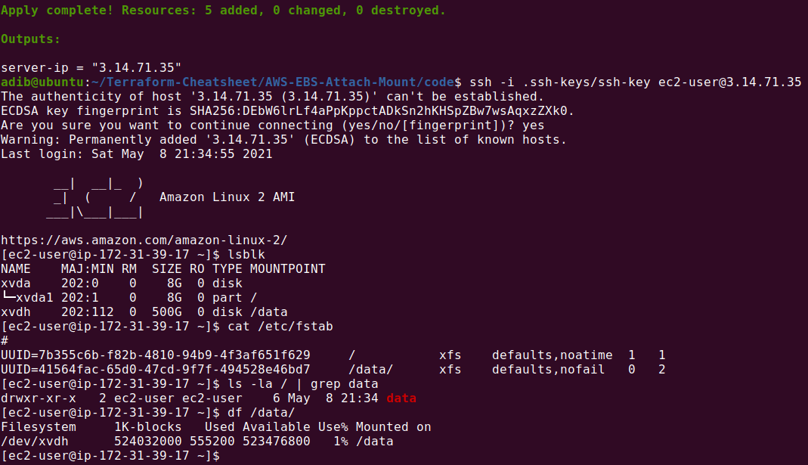

### Prerequisites
How to launch an Instance with Attached and Mounted EBS volume in AWS Cloud?
Here's a simple Terraform template with a boot-strapping/user-data script you may use.
It works for me and I find it useful for others.

### Commands to execute
Create ssh-keys to connect the server:
```
mkdir .ssh-keys
ssh-keygen
```
Terraform commands:
```
terraform init
terraform plan
terraform apply

terraform destroy
```
### Commands to check the results
To make ssh-connect:
<br>
`ssh -i .ssh-keys/ssh-key ec2-user@<server-ip>`

To check the results:
```
lsblk
cat /etc/fstab
ls -la / | grep data
df /data/
```
If you haven't seen the results please wait for at least 2 minutes to check disk is mounted.
#### Resulting screenshots
ssh-connect && result confirmation:
<br>

### Links of used resources
<a href="https://registry.terraform.io/providers/hashicorp/aws/latest/docs/resources/volume_attachment">Terraform Docs</a>
<br>
<a href="https://docs.aws.amazon.com/AWSEC2/latest/UserGuide/ebs-using-volumes.html">AWS Docs</a>
<br>
<a href="https://github.com/adv4000/terraform-lessons">Terraform Lessons by Denis Astahov</a>

### Issues
1. For now, the mounting process included in `run.sh` starts after 120 sec after the instance was added. It's more much better to run by the event of EBS-volume attachment.

2. In different regions, the value of AMI filter in `data.tf` may differ.

3. There's no elastic IP on the template.
If you are going to stop the instance you created via template its IP address may be changed while starting.
But it works after the instance reboot.

4. I have Terraform version of `Terraform v0.15.0`. In earlier versions, especially in v0.12 and older ones, it won't work.
