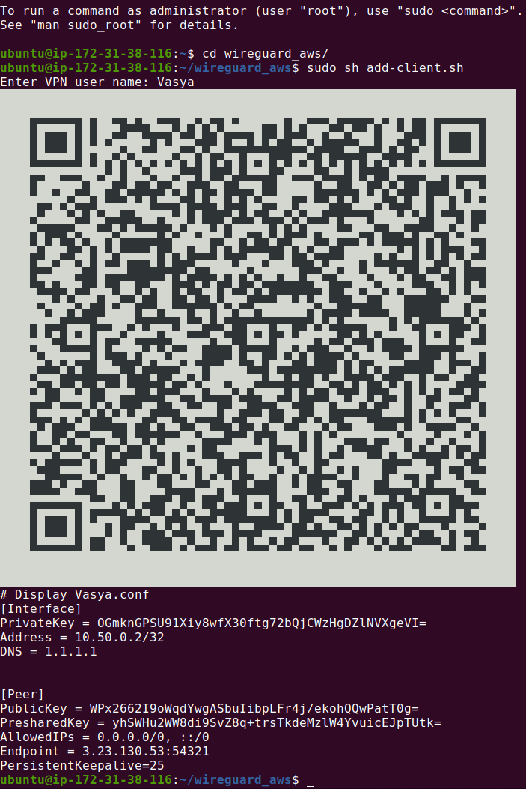

### Prerequisites
How to Launch WireGuard VPN-Server on AWS Instance via Terraform.
<br>
Here's a simple Terraform template with a boot-strapping/user-data script you may use.
It works for me and I find it useful for others.

### Commands to execute
Create ssh-keys:
```
mkdir .ssh-keys
ssh-keygen
```
Launch VPN-Server using Terraform:
```
cd Terraform-Cheatsheet/AWS-VNP-WireGuard/
./vpn-server apply
```
Add user on remote-server:
```
cd wireguard_aws/
sudo sh add-client.sh
```
Destroy VPN-Server using Terraform:
```
cd Terraform-Cheatsheet/AWS-VNP-WireGuard/
./vpn-server destroy
```
### Result
Scan QR-code using WireGuard app from AppStore or Google Play on the phone/tablet or pass credentials to the app on Mac/PC.
<br>

##### <center>Relax!</center>
### Links of used resources
<a href="https://github.com/pprometey/wireguard_aws">Alexey Chernyavskiy's Github</a>
<br>
<a href="https://habr.com/ru/post/448528/">The article about manual deployment in Russian</a>
### Issues
- It takes about extra 10 seconds for `user_data.sh` to be completed after ssh-connect. Please wait.
- In different regions, the value of AMI filter in `data.tf` may differ.

- I have Terraform version of `Terraform v0.15.0`. In earlier versions, especially in v0.12 and older ones, it will not work.
